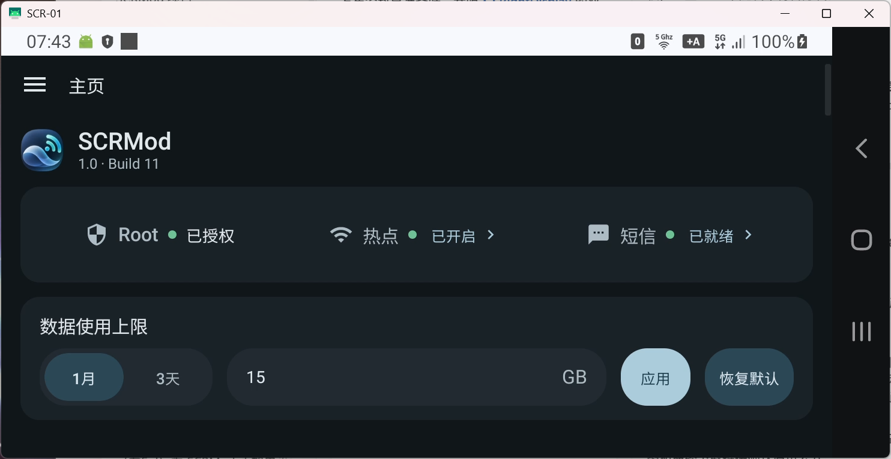
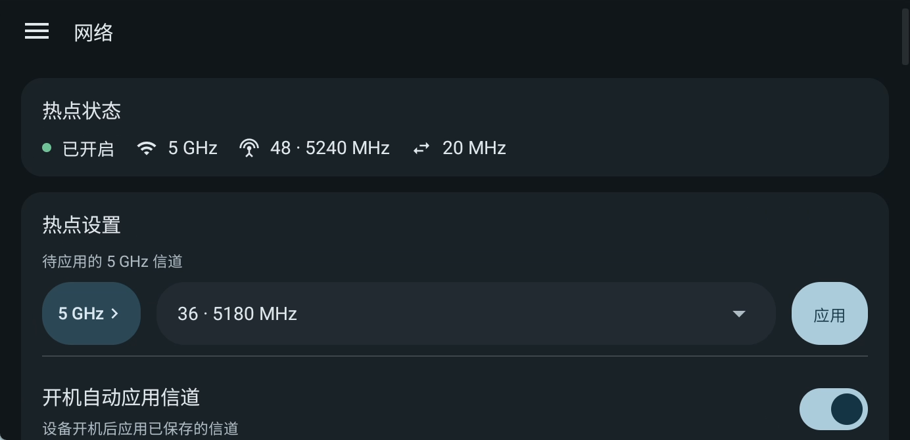
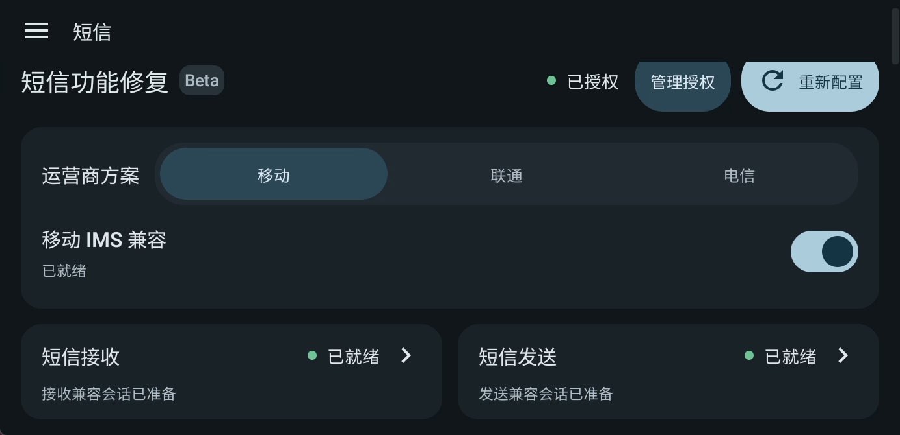

<p align="center"></p>

<h1 align="center">SCRMod</h1>

<p align="center"><strong>Advanced Control &amp; Diagnostics for Samsung SCR-01</strong><br>把热点控制、数据上限与设备诊断，放进一个清晰的界面。</p>

<p align="center">


</p>

<p align="center"><a href="https://github.com/RedoRosetta/SCRMod/releases/download/v1.0-build11/SCRMod-1.0-build11-v40-slim-ui-aligned-v9.apk"><strong>下载 APK</strong></a> · <a href="#下载与安装">安装指南</a> · <a href="https://github.com/RedoRosetta/SCRMod/releases/tag/v1.0-build11">版本说明</a> · <a href="https://github.com/RedoRosetta/SCRMod/issues/new/choose">问题反馈</a> · <a href="#源码与许可">源码范围</a></p>

<p align="center">Samsung Galaxy 5G Mobile Wi-Fi SCR-01 / SM-H412J · Android 11 · 横竖屏与深浅色模式</p>

SCRMod 把 SCR-01 日常使用中常见的几件事放到一起：**调整热点信道、修改数据使用上限，以及修复短信收发功能。** 首页集中显示运行状态，网络和设置页面提供检查与诊断入口，方便调整后确认结果。

## 调整数据上限，分别管理两个周期

首页可以分别设置 **1 个月和 3 天**的数据使用上限，支持输入 **1–2000 GB**，也可以一键恢复默认。两个周期独立保存，切换周期后即可查看和修改对应数值。

<p align="center"></p>

这里调整的是设备本地的数据上限设置，不会改变 SIM 卡套餐额度或运营商的限速规则。首页同时显示 Root、热点和短信状态，便于判断相关功能是否已准备好。

## 选择 5 GHz 热点信道

网络页把热点当前的**频段、信道、频率和带宽**放在一起。需要调整时，可先进入系统频段设置，再选择信道并应用；也可以保存配置，开启开机自动应用。

<p align="center"></p>

提供 36、40、44、48 等信道选项；149、153、157、161 是否可用取决于设备的监管域和运行环境。当前运行值与待应用值分开显示，选择一个信道并不表示设备已经切换成功，应用后应查看实际状态。

## 短信功能修复 · Beta

完整安装包提供针对 SCR-01 的短信收发修复入口。按运营商选择移动、联通或电信方案，查看接收和发送状态；需要重新处理时，点击「重新配置」。移动方案另提供 IMS 兼容开关。

<p align="center"></p>

修复功能配合**另行安装的兼容三星短信 APP**使用，短信仍由短信 APP 查看和收发。使用前需要完成相应授权。三星 APP 不包含在 SCRMod 安装包或本仓库中。

短信修复仍处于 Beta 阶段，效果受三星 APP 版本、运营商、SIM、固件及 IMS 状态影响。页面显示「已就绪」后，仍需实际收发短信确认。

## 日常设置与诊断

- **开机自动应用：** 保存常用配置，在启动且权限与设备条件满足时尝试应用。
- **NAT 诊断：** 一键测试当前网络出口，也可指定测试地址，辅助排查连接问题。
- **诊断记录：** 在设置页查看和复制运行信息，方便反馈故障。
- **横竖屏与深浅色：** 根据使用方向和系统主题调整布局与配色。

NAT 功能用于诊断，不提供 Full Cone 或 NAT A 保证，也不能改变运营商上游网络的策略。

## 下载与安装

**[下载 SCRMod 1.0 (build11)](https://github.com/RedoRosetta/SCRMod/releases/download/v1.0-build11/SCRMod-1.0-build11-v40-slim-ui-aligned-v9.apk)** · [版本说明与校验文件](https://github.com/RedoRosetta/SCRMod/releases/tag/v1.0-build11)

1. 按 [SCRoot](https://github.com/hackintoanetwork/SCRoot) 的说明准备 SCR-01，取得临时 Root，并确认 KernelSU-Next 权限可用。
2. 下载并安装 Release 中的 **APK**。同签名版本可覆盖更新，保留应用数据。
3. 为 SCRMod 授予 Root 权限，确认首页状态，再按需设置数据上限和热点信道。
4. 如果需要短信修复，另行准备兼容的三星短信 APP，并完成应用内授权。

SCRMod 使用设备已有的 Root 环境，不负责获取 Root。重启后需要按 SCRoot 的说明重新确认权限；开启「开机自动应用」不等于自动获得 Root。

<details>
<summary>版本、签名与文件校验</summary>

当前版本为 **1.0 (build11)**，`versionCode 40`，APK 约 **25.7 MiB**。安装包经过压缩，沿用历史 Android debug 证书以保持覆盖升级兼容性，尚未切换独立生产证书。遇到签名冲突时不要直接卸载，以免丢失设置与授权。

SHA-256：

```text
4f919a9f3adc36a25b746452b5cbf253197418e2a310ef8a2b02f83816a2e298
```

</details>

## 兼容性

| 项目 | 当前目标环境 |
| --- | --- |
| 设备 | Samsung Galaxy 5G Mobile Wi-Fi SCR-01 / SM-H412J |
| 系统 | Android 11 |
| 固件 | SCR01KDU1AVK2 |
| 内核 | 4.14.186-24165939 |
| 控制权限 | 可用的 Root / KernelSU-Next 环境 |

其他设备、固件和内核组合未保证兼容。实际信道应用受到硬件、驱动及安全检查约束。截图展示的是完整 APK 的真实运行界面，已裁去窗口边框与系统栏；截图状态不代表所有使用环境的结果。

## 源码与许可

公开仓库包含 UI、设备检查、热点与信道控制、数据上限和 NAT 诊断相关代码。**短信修复、IMS 兼容、注入资产及授权实现不公开，完整 APK 保留这些功能。** GitHub 自动生成的 Source code 压缩包只能用于构建公开功能版，不能重建完整 APK。

[源码范围](docs/SOURCE_SCOPE.md) · [构建说明](docs/BUILD.md) · [第三方材料](THIRD_PARTY_NOTICES.md)

自有应用源码暂未授予开源许可证，版权由作者保留；第三方组件和资产遵循各自许可证。信道模块源码见 [kernel/scr01_idc36](kernel/scr01_idc36/)，模块声明采用 GPL 许可。

## 感谢 SCRoot

SCRMod 的运行建立在 [SCRoot](https://github.com/hackintoanetwork/SCRoot) 对 SCR-01 临时 Root 与 KernelSU-Next 的支持之上。感谢 **hackintoanetwork 和 SCRoot 项目贡献者**，让这些设备侧调整成为可能。

两者为独立项目，SCRMod 不捆绑 SCRoot 的提权流程或安装包。

## 问题反馈

欢迎通过 [GitHub Issues](https://github.com/RedoRosetta/SCRMod/issues/new/choose)反馈问题或建议。请说明应用与固件版本、操作步骤、预期结果和实际现象；短信问题请补充运营商及短信 APP 版本。

上传截图或日志前，请删除短信内容、手机号、设备码、授权文件和密钥等私人信息。[安全说明](SECURITY.md)

---

<p align="center"><strong>SCRMod</strong><br>Advanced Control &amp; Diagnostics for Samsung SCR-01<br>Developed by <a href="https://github.com/RedoRosetta">RedoRosetta</a></p>
